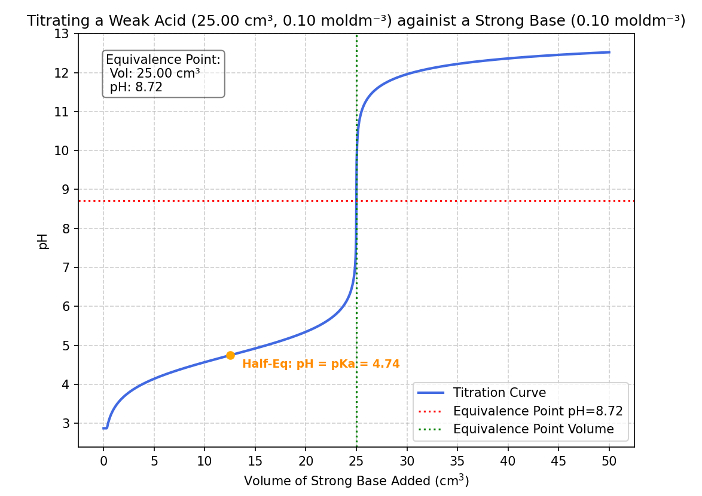

# Project: Vectorized pH Titration Engine

## Overview:
This is a high-performance titration simulator built with **NumPy** and **Matplotlib**. The pH Titration Engine simulates the chemical transition of acids during neutralisation with a strong base, supporting both strong and weak acid models.

## Key Features of the Project:
* **Vectorised Calculations:** Uses NumPy `np.where` to process 1000+ data points instantly, way more efficient than Python loops.
* **Weak Acid Support:** Implements the **Henderson-Hasselbalch** equation for the buffer region and salt hydrolysis for the equivalence point, using a variable acid dissociation constant.
* **Visualisation:** * Marks the **Half-Equivalence** automatically ($pH = pK_a$).
    * Changing axis ticking based on user input volume.
    * Annotated the equivalence point with real-time pH and Volume data.


## 🧪 Example Output
**Input:** 25.0 cm³ of 0.1M CH₃COOH (Ka = 1.8e-5) vs 0.1M NaOH.
**Result:** A smooth curve starting at pH ~2.87, passing through a buffer region, with an equivalence point at pH ~8.72.




## Installation & Usage:
To run this simulation, you will need Python 3.x and the following libraries:
* **NumPy**: For high-performance vectorized math
* **Matplotlib**: For generating the titration curves.

```bash
pip install numpy matplotlib
python titration_engine.py
```

## Progress:
**Day 1:** Created a basic engine for calculating a pH under variable concentrations and volumes of a strong acid and a strong base.

**Day 2-3:** Added a vectorised volume of base to produce a list of changing pH values using **NumPy**.

**Day 4:** Generate a smooth titration curve using **Matplotlib** to visualise results.

**Day 5:** Refined the engine to accept weak acid inputs.

## What I Learned:
**Mathematical singularities:** When calculating the pH of a weak acid exactly at the equivalence point, the Henderson-Hasselbalch equation attempts to divide by zero (as the net amount tends to 0), causing the pH to spike.
* From an engineering perspective, it is more beneficial to minimise the anomalies, producing a smooth curve. I implemented a small mask using `np.where` around the equivalence volume that bypasses the buffer equation and instead uses the salt hydrolysis formula ($pH = 7 + 0.5(pK_a + \log C_{salt})$).

**Assigning Variables:** Instead of deriving a single mega-formula to handle all cases, splitting the function into manageable calculations lets me catch mistakes earlier. For example, instead of inputting different equations straight into the nested `np.where` function, I divided the pH calculations into three segments: the initial state, buffer zone, and excess base.


**Testing Inputs:** Setting default inputs in the code (and changing to the user's input after debugging) is way more efficient than entering inputs for every run in the terminal.

**NumPy Functions:** Specific commands such as `np.errstate`, `np.linspace`, `np.nditer` to handle arrays more efficiently.

**Matplotlib Axis Ticking:** To avoid axis tick labels from cramming against each other, I can utilise the `max()` function to adapt to large range inputs.